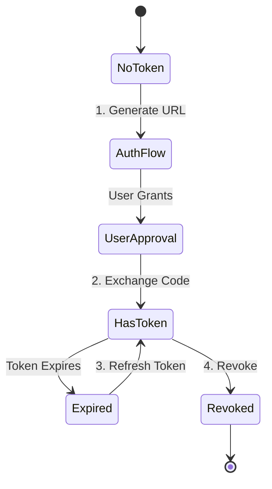

# GitHub Authentication Types and Tokens

The idea of this document is to summarize and explain the various types of tokens you can use for authenticating towards GitHub, their use cases, scopes, limitations, and other useful information.

OIDC is taken outside the scope of this document since it is already covered in other provided documents (committed to this repo).

Also, the native `GITHUB_TOKEN` from GitHub Workflows will be shortly mentioned since the topic has already been covered in `github-app-token-or-github-actions-token.md`.


---

## Table of Contents

1. [Reference Table](#reference-table)
2. [Personal Access Tokens (PATs)](#personal-access-tokens-classic-pats)
   - [Fine-Grained Personal Access Tokens](#fine-grained-personal-access-tokens)
3. [GitHub Apps](#github-apps)
   - [Installation Access Token](#installation-access-token-app-installation-token)
   - [User Access Token](#user-access-token-for-github-apps)
4. [GitHub Actions Native Token](#github-actions-native-token-github_token)

---

## Quick Reference Table

| Auth Method | Prefix | Max. Lifetime | Rotation | Permissions Model | Rate Limit | Headless**? |
|---|---|---|---|---|---|---|
| Fine-Grained PAT | `github_pat_` | Indefinite | 30-90 days recommended | Fine-grained | 5K/hr | ✅ Yes |
| Classic PAT | `ghp_` | Indefinite | 30-90 days recommended | Broad | 5K/hr | ✅ Yes |
| Installation Token | `ghs_` | 1 hour | N/A (renewed) | Fixed (App) | 15K/hr | ✅ Yes |
| User Access Token | `ghu_` / `ghr_` | 8 hrs / 6 mo | Via refresh token | User and App | 5-15K/hr* | ❌ No |
| GITHUB_TOKEN | `ghs_` | Job duration | N/A | Fixed (Repo) | 5K/hr | ✅ Yes |¨

** Headless means the authentication method can be used in automated/unattended scenarios without requiring user interaction or a graphical interface.

---

## Personal Access Tokens (Classic PATs)

Personal Access Tokens (prefix `ghp_`) are the most straightforward way to authenticate to GitHub for API operations or command-line access. They can act as an alternative to passwords.

These type of tokens can be set to "No expiration", but it is highly recommended to set an expiration date and rotate them regularly. Its rate limit 5000 requests per hour.

When it comes to permission scope, Classic PATs use broad scopes that grant access to many resources and are an extension of the permission of the user (disconsidering SSO auth). It is often more challenging to follow the principle of least privilege with Classic PATs compared to Fine-Grained Tokens.

Classic PATs cannot be owned by any other actor rather than a user (in opposed to Fine-Grained Tokens which can have a different resource owner).

The recommendation for Classic PATs is for legacy scripts or tools that haven't been updated to support fine-grained permissions or GitHub Apps.

### Fine-Grained Personal Access Tokens

More secure and modern approach to authentication. Prefixed by `github_pat_`. Better for least-privilege access patterns.

Its maximum lifetime can also be indefinite (no expiration) but the recommendation remains to set an expiration date (between 1 and 366 days) and rotate them regularly. Its rate limit 5000 requests per hour.

As its name indicates, Fine-Grained PATs allow specifying exact repositories and organizations they can access, along with precise permissions (read, write, admin) for each resource type, which is an improvement compared to Classic PATs which were an extension of the user's permissions. However, certain resources may not possible to access via Fine-Grained tokens, such as GitHub Packages (November 2025), but instead accessible via Classic PATs.

Fine-Grained tokens can also be assigned to a different resource owner (such as organizations which the user is a member of). This allows scenarios where a user changes their role or leaves the company, but the token remains valid under the organization's ownership. This feature is also useful as an option to machine users (which would usually take a license seat in the organization). Beyond that, another critical feature of FG-PATs is that the permission does not extend the user's permissions but is strictly limited to what is defined during token creation. Example: if a FG-PAT is created with a user as resource owner, then only resources under the user can be accessed, even if the user has broader permissions.

The recommendation of Fine-Grained PATs is the same as for Classic PATs, replacing them whenever possible.

### Installation Access Token (App Installation Token)

Via GitHub Apps, App Installation Tokens can be generated by exchanging a JWT for an installation-specific token. It uses the prefix `ghs_`, and it reflects the GitHub App's access and permission to a specific user account or organization.

The lifetime of a App Installation Token itself is 1 hour, but it requires the JWT part of the generation process to be sent within 10 minutes of its creation. During long processes, it is recommendable to create new tokens (renewed token) whenever reaching either the rate limits or the expiry time. Its rate limit 15000 requests per hour.

Similarly to FG-PATs, Installation Tokens do not extend the permissions of any user but are limited to what the GitHub App was granted at installation time towards an organization or user.

The use-cases for App Installation Tokens are for repository automation, CI/CD workflows on bigger scopes, reaction to webhook events (IssueOps, etc). and any operation that needs to be performed without user interaction.

### User Access Token (For GitHub Apps)

Via GitHub Apps, User Access Tokens (or GitHub App User Access Tokens) can be generated to act on behalf of a user. It uses the prefix `ghu_` and `ghr_` (for the refresh token), and it reflects both the GitHub App's permissions and the user's own permissions (as an intersection of the permissions).

The lifetime of a User Access Token is _not_ configurable. The UAT is valid for 8 hours and the refresh token valid for 6 months. The logic for this process works via a single user authentication which then returns a refresh token that then can be used to get new access tokens. This design is meant to prevent developers from creating permanent, high-privilege credentials, which is a key feature for this flow. And to conclude, its rate limit is 15000 requests per hour as soon as the GitHub App is owned by the an Enterprise OR an Org under an Enterprise, meaning that GitHub Apps owned by a user will still be limited to 5000 requests per hour.

As previously mentioned, the permissions of a UAT are the intersection of what the GitHub App was granted and what the user themselves have access to. This means that even if the GitHub App has broad permissions, the UAT will only be able to perform actions that the user is allowed to do.

The flow for token renewal uses the original refresh token to request a new access token, then GitHub returns a new access token plus new refresh token, which should be stored. In order to keep using this, make sure to repeat the process before the new refresh token expires.

The use-cases for UAT are for operations that need to be performed on behalf of a user, such as repository scaffolding, PR/issues management, or reading user-specific data. It is also useful for workflows that require user attribution.

References: 
- Documentation: https://docs.github.com/en/apps/creating-github-apps/authenticating-with-a-github-app/generating-a-user-access-token-for-a-github-app
- Scripts written to emulate the flow, see README in the scripts folder:
    - `ghapp-user-token.py` to generate the URL for authentication, code processing, token refresh process, and token revokation.
    - `callback-server.py` which exposes the server. Ngrok or similar tool can be used to expose the local server to GitHub during the flow.

Flow: 



**Command Steps:**

### 1. Authorization Flow

Generate authorization URL for user to grant permission.

```bash
./ghapp-user-token.py --client-id YOUR_ID --client-secret YOUR_SECRET --redirect-uri <uri>
```

### 2. Manual authorization
Click on the generated URL, approve the app, and get the **code** from the redirected URL.


### 3. Exchange Code for Tokens

Exchange authorization code for access token and refresh token, respecitively prefixed by `ghu_` and `ghr_`.

```bash
./ghapp-user-token.py --client-id YOUR_ID --client-secret YOUR_SECRET --code v12d2dvsadjkandw2
```

### 4. Refresh Access Token

Get new access token and refresh token using existing refresh token.

```bash
./ghapp-user-token.py --client-id YOUR_ID --client-secret YOUR_SECRET --refresh-token ghr_xxxxx
```

### 5. Revoke Token

Invalidate access token or refresh token.

```bash
./ghapp-user-token.py --client-id YOUR_ID --client-secret YOUR_SECRET --revoke gho_xxxxx
```

Further Reference:
https://docs.github.com/en/apps/creating-github-apps/authenticating-with-a-github-app/generating-a-user-access-token-for-a-github-app

## GitHub Actions Native Token (GITHUB_TOKEN)

This token is natively generated every time a GitHub Actions workflow runs. It uses the prefix `ghs_` and is scoped to the repository where the workflow is running. The token's lifetime is limited to the duration of the workflow run, meaning it expires once the job is complete. Its rate limit is 5000 requests per hour and its permissions are configurable via the workflow file, however the scope is limited to the repository where the workflow is running.

Documentation in this topic has already been delivered in [github-app-token-or-github-actions-token.md](https://aptv.ghe.com/DevSecOps/GH-DSO/blob/main/docs/gh-app-token-vs-actions-token/github-app-token-or-github-actions-token.md).

---
